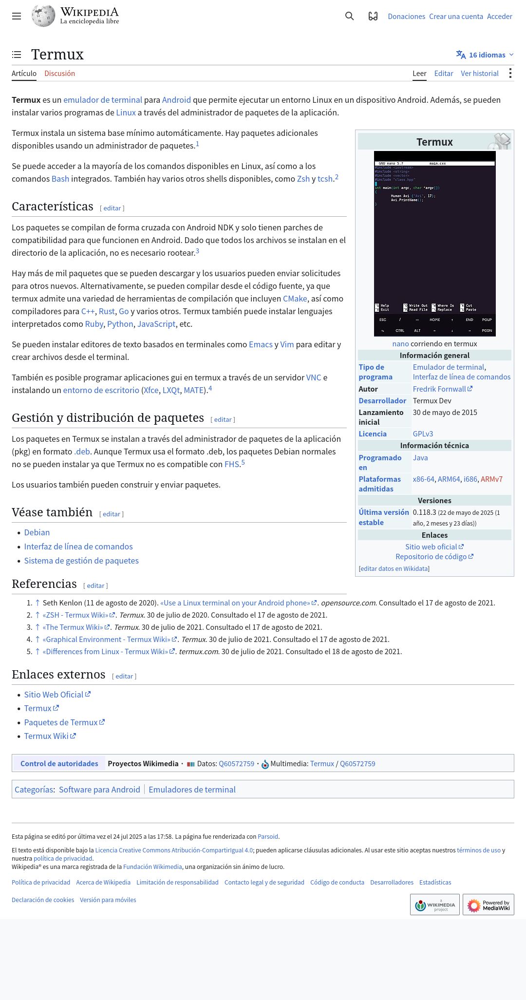
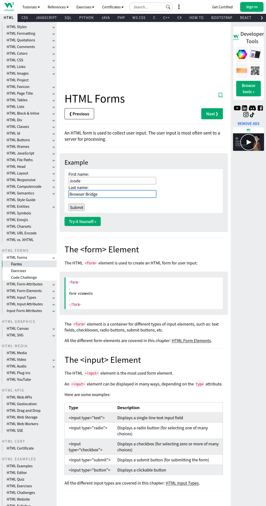

# 🌐 Puente de Navegador ⇄ Walkie (X11)

Controla el navegador **Firefox** (renderizado en el entorno gráfico **Termux X11**)
desde la red P2P de WalkieTermux: investigación web, relleno de formularios,
extracción de contenido y captura de pantalla. Todo manejable por **agentes de IA**
o desde la **terminal**, sin servidores.

```
 agente de IA  ──►  walkie-browser  ──►  WebSocket :8766  ──►  host Rust (nativo)
 (canal P2P)        (CLI/agente)            │
                                            ▼
                                   extensión Firefox
                                            │
                                            ▼
                                   página renderizada  ──►  X11 (Termux X11 / Xwayland)
```

## ¿Qué es el "bridge con X11"?

Es la pieza que **pone Firefox bajo control de los agentes de Walkie**. Firefox
corre como aplicación gráfica en la sesión **Termux X11** (`DISPLAY=:0`), y el
puente conecta la red P2P de Walkie con esa sesión mediante un **host nativo** y
una **extensión de Firefox**:

| Componente | Función |
|---|---|
| `walkie-browser` | CLI que lanza acciones del navegador desde la terminal o como agente del canal |
| `walkie-browser-bridge.js` | Agente que ejecuta comandos de navegador enviados por cualquier peer del canal P2P |
| `browser` (`~/.jcode/browser/browser`) | Binario CLI de [firefox-agent-bridge](https://github.com/1jehuang/firefox-agent-bridge) v1.0.0 (ARM64) |
| `firefox-agent-bridge-host` | Host nativo que habla con la extensión por WebSocket `:8766` |
| Extensión Firefox (XPI) | Lee/escribe la página dentro del navegador en la sesión X11 |

## Requisitos

- Firefox instalado y corriendo en **Termux X11** (`DISPLAY=:0`).
- [firefox-agent-bridge](https://github.com/1jehuang/firefox-agent-bridge) v1.0.0 instalado en `~/.jcode/browser/`.
- El daemon de walkie corriendo (`walkie status` debe responder).

## Puesta en marcha (X11)

1. **Arranca la sesión gráfica de Termux X11** (desde el teléfono, la app `Termux:X11`
   o con `termux-x11`), que expone `DISPLAY=:0` vía `Xwayland`.
2. **Lanza Firefox dentro de esa sesión** (normalmente con `DISPLAY=:0 firefox`).
   El puente interactúa con la página renderizada en ese display.
3. Verifica el registro del host nativo:
   `~/.mozilla/native-messaging-hosts/firefox_agent_bridge.json`.
4. Comprueba la conexión:
   ```bash
   walkie-browser ping      # → debería devolver { "pong": true }
   ```

## Uso

```bash
# Acción directa al navegador (JSON como segundo argumento)
walkie-browser navigate '{"url":"https://example.com"}'
walkie-browser getContent '{"format":"text"}'
walkie-browser fillForm '{"fields":[{"selector":"input[name=fname]","value":"Ana"}]}'
walkie-browser screenshot '{"filename":"/ruta/captura.png"}'

# Agente en el canal P2P (recibe comandos y responde)
walkie-browser bridge canal-agentes:TU_SECRETO --name browser-bot

# Utilidades
walkie-browser ping      # comprobar que Firefox responde
walkie-browser help      # ayuda
```

En el canal, el agente entiende dos formatos de mensaje:

```json
{ "action": "navigate", "params": { "url": "https://example.com" } }
```

```text
browser navigate '{"url":"https://example.com"}'
```

y responde con el prefijo `[browser]`, truncado a 4000 caracteres para no
saturar el canal.

## Funciones del bridge

### Navegación

| Función | Descripción |
|---|---|
| `navigate` | Ir a una URL (`{"url":"https://..."}`). |
| `reload` | Recargar la página actual. |
| `listTabs` | Listar las pestañas abiertas. |
| `newSession` | Abrir una nueva sesión/pestaña de navegador. |
| `setActiveTab` | Activar una pestaña concreta. |
| `getActiveTab` | Devolver la pestaña activa actual. |

### Contenido

| Función | Descripción |
|---|---|
| `getContent` | Extraer el contenido de la página. Formatos: `text`, `html`, `annotated` (texto con selectores), `title`. |
| `getInteractables` | Enumerar los elementos interactivos visibles (botones, inputs, enlaces). |
| `scout` | Investigar un sitio web de forma estructurada. |
| `preexplore` | Exploración previa del sitio antes de actuar. |

### Interacción

| Función | Descripción |
|---|---|
| `click` | Hacer clic en un elemento (`{"selector":"..."}`). |
| `type` | Escribir en un campo (`{"selector":"...","text":"..."}`). |
| `fillForm` | Rellenar varios campos a la vez (`{"fields":[{"selector":"...","value":"..."}]}`). |
| `evaluate` | Ejecutar JavaScript en la página (`{"script":"..."}`). |
| `scroll` | Desplazarse por la página. |
| `uploadFile` | Subir un archivo a un `<input type="file">`. |
| `dropFile` | Arrastrar/soltar un archivo sobre un elemento. |

### Captura

| Función | Descripción |
|---|---|
| `screenshot` | Capturar la pantalla a PNG. En Termux hay que pasar `filename` con ruta válida (por defecto `/tmp`, que no existe). |

### Avanzado / sesión

| Función | Descripción |
|---|---|
| `fork` | Clonar la sesión actual en otra independiente. |
| `parallel` | Ejecutar varias acciones del navegador en paralelo. |
| `batch` | Ejecutar una lista de acciones en secuencia. |
| `tryUntil` | Reintentar una acción hasta que se cumpla una condición. |
| `waitFor` | Esperar a que aparezca un elemento/condición. |
| `autoLogin` | Autocompletar login usando la bóveda Bitwarden (`{"domain":"..."}`). |
| `vaultStatus` | Estado de la bóveda Bitwarden. |

### Utilidades

| Función | Descripción |
|---|---|
| `ping` | Comprobar que el navegador responde (`{ "pong": true }`). |
| `help` | Mostrar las acciones disponibles. |

La investigación web nativa del agente (sin navegador) usa `websearch` y `webfetch`.

## Flujo real validado (en vivo)

1. **Investigación**: `navigate` a Wikipedia → `getContent` extrajo el artículo completo.
2. **Formulario**: `navigate` a w3schools → `fillForm` escribió `fname`/`lname` → `evaluate` verificó los valores.
3. **Captura**: `screenshot` guardó el PNG como evidencia visual.
4. **Agente P2P**: un peer envió `browser ping` al canal → el agente respondió `[browser] ✅ ping`.

## Capturas reales

Flujo en vivo del puente controlado por el agente (datos de prueba, sin información sensible):

**Investigación web** — extracción de contenido desde Wikipedia:



**Relleno de formulario** — `fillForm` escribiendo valores en w3schools:



## Notas técnicas

- El wrapper evita el bug de `PARAMS="${1:-{}}"` (añadía una `}` extra al JSON).
- `screenshot` escribe por defecto en `/tmp`; en Termux hay que pasar `filename`.
- El agente sale limpiamente con `SIGINT`/`SIGTERM` (deja el canal).
- Firefox debe correr en la sesión **X11** activa (`DISPLAY=:0`); el puente no
  arranca la sesión gráfica por sí mismo.
